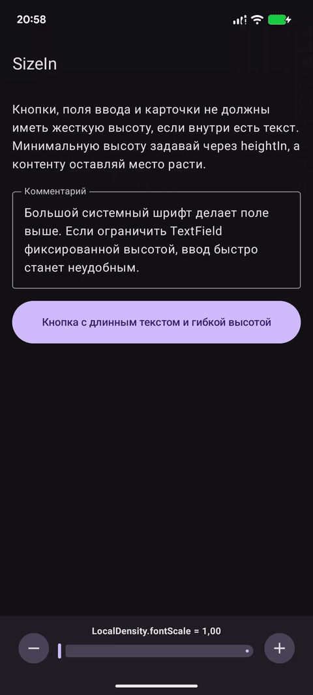
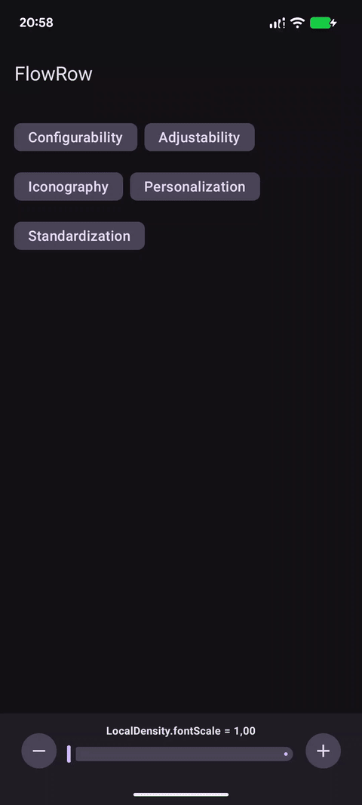
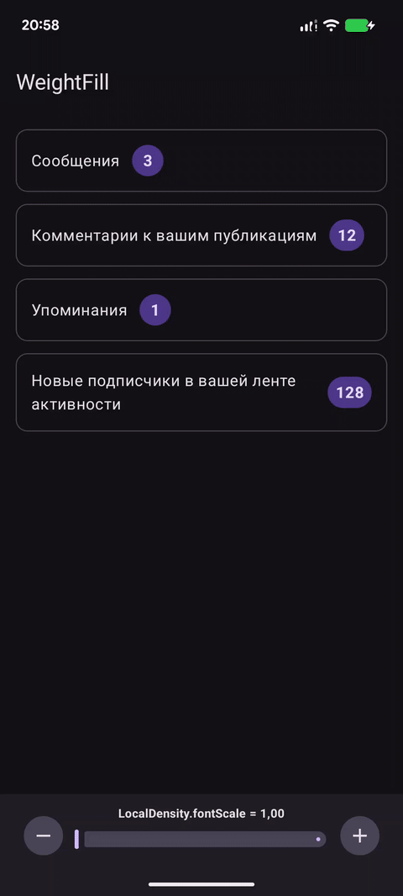
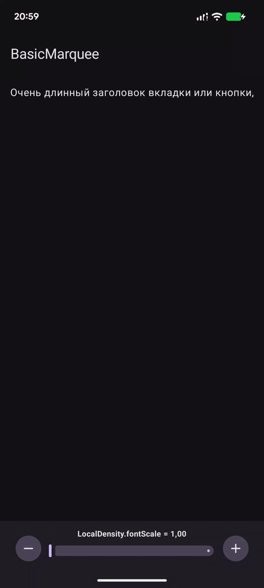
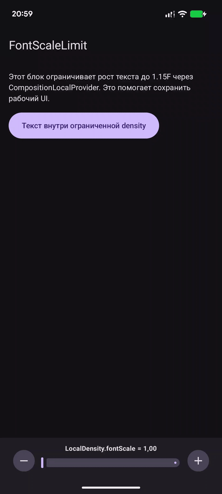
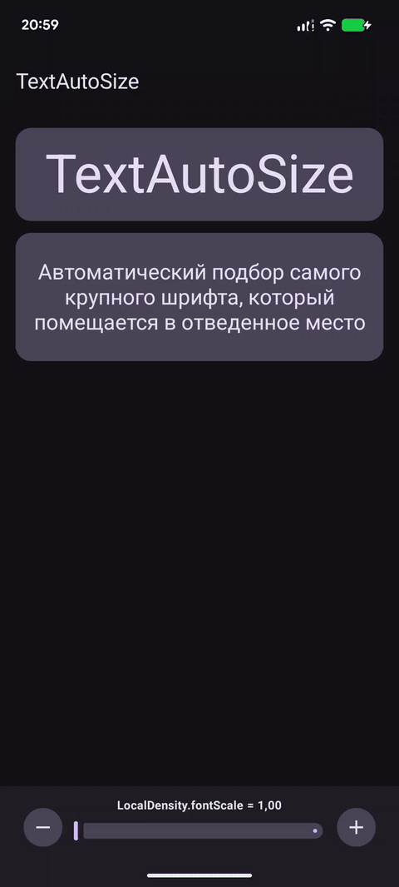
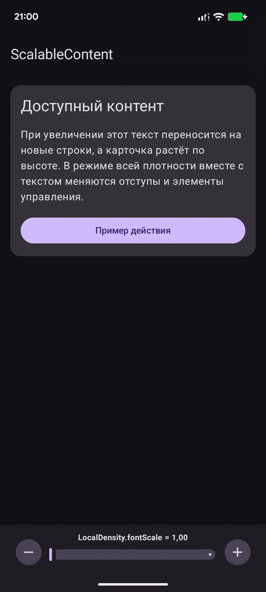

# FontScale

Android-пример про адаптацию Compose UI к увеличенному системному размеру текста.

  
  
  
  

  
  
  

## Samples

| # | Sample                                                                                                | Description                                                                          |
|---|-------------------------------------------------------------------------------------------------------|--------------------------------------------------------------------------------------|
| 1 | [ScaleInfo](app/src/main/kotlin/org/michaelbel/fontscale/sample01_ScaleInfo/Sample01App.kt)           | Отображение текущего `LocalDensity.fontScale` и переход в системные настройки текста |
| 2 | [SizeIn](app/src/main/kotlin/org/michaelbel/fontscale/sample02_SizeIn/Sample02App.kt)                 | Гибкая высота полей ввода и кнопок через `heightIn` вместо фиксированной высоты      |
| 3 | [FlowRow](app/src/main/kotlin/org/michaelbel/fontscale/sample03_FlowRow/Sample03App.kt)               | Перенос чипов на новую строку с помощью `FlowRow` при увеличенном шрифте             |
| 4 | [WeightFill](app/src/main/kotlin/org/michaelbel/fontscale/sample04_WeightFill/Sample04App.kt)         | Список уведомлений с `weight(fill = false)`, чтобы текст не обрезался                |
| 5 | [BasicMarquee](app/src/main/kotlin/org/michaelbel/fontscale/sample05_BasicMarquee/Sample05App.kt)     | Бегущая строка через `basicMarquee` для текста, не помещающегося на экране           |
| 6 | [FontScaleLimit](app/src/main/kotlin/org/michaelbel/fontscale/sample06_FontScaleLimit/Sample06App.kt) | Ограничение роста `fontScale` через `CompositionLocalProvider` с кастомной `Density` |
| 7 | [TextAutoSize](app/src/main/kotlin/org/michaelbel/fontscale/sample07_TextAutoSize/Sample07App.kt)     | Автоматический подбор размера текста под контейнер через `TextAutoSize`              |
| 8 | [ScalableContent](app/src/main/kotlin/org/michaelbel/fontscale/sample08_ScalableContent/Sample08App.kt) | Масштабирование всего UI или только текста через pinch-to-zoom и `LocalDensity`     |
